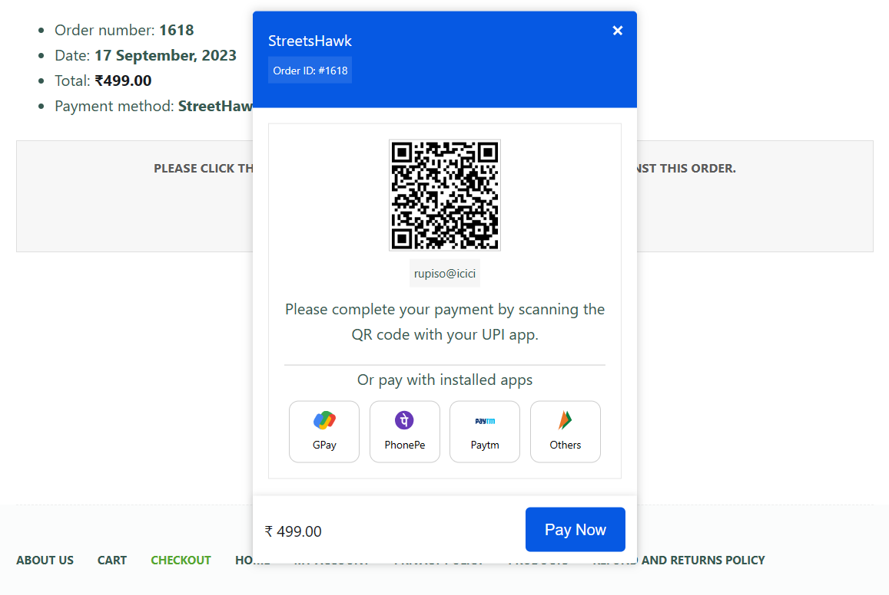
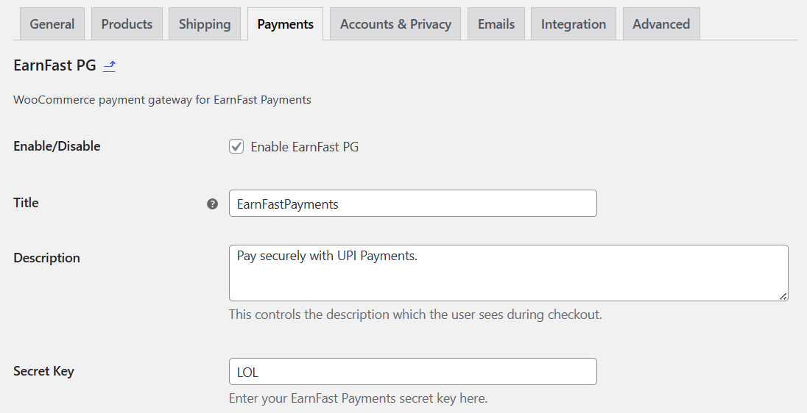

# WooCommerce EarnFastPayments Payment Gateway

This WordPress plugin integrates EarnFastPayments.com as a payment gateway for WooCommerce, allowing online stores to offer a seamless and secure payment option to their customers.

## Features

- **Seamless Integration:** Easily add EarnFastPayments as a payment option on your WooCommerce store.
- **Secure Transactions:** Ensures secure and reliable payment processing for your customers.
- **Simple Configuration:** Quick and straightforward setup for store owners.
- **Enhanced Checkout Experience:** Offer a variety of payment methods for your customers, enhancing their shopping experience.
- **UPI Payment Option:** Customers on mobile devices can conveniently pay using installed UPI (Unified Payments Interface) apps.

## Installation

To install the WooCommerce EarnFastPayments Payment Gateway plugin, follow these steps:

1. Download the plugin ZIP file from the [GitHub repository](https://github.com/khanra17/WooCommerce-EarnFastPayments).
2. Log in to your WordPress Admin Panel.
3. Navigate to the Plugins section.
4. Click the "Add New" button.
5. Click the "Upload Plugin" button and choose the downloaded ZIP file.
6. Activate the plugin.

## Configuration

After activation, configure the plugin to start accepting payments via EarnFastPayments:

1. Log in to your WordPress Admin Panel.
2. Navigate to WooCommerce > Settings.
3. Click the "Payments" tab.
4. Find "EarnFastPayments" and make sure it's "Enabled".
5. Click the "Manage" button.
6. Configure your EarnFastPayments account details.
7. Save changes.

## Usage

Once configured, the WooCommerce EarnFastPayments Payment Gateway plugin seamlessly handles the payment process for your customers. Here's how it works:

1. When a customer selects EarnFastPayments as the payment method during checkout, the plugin initiates the payment process.
2. In the background, the plugin continuously checks for payment confirmation from EarnFastPayments.
3. Once the payment is confirmed, the plugin automatically redirects the customer to the next page in the WooCommerce order process, updates order status, ensuring a smooth and uninterrupted shopping experience.
4. It then generates invoices and sends payment confirmation emails to both the customer (and the store owner), streamlining the post-payment process.

This automated workflow simplifies the payment process for both customers and store owners, reducing the need for manual intervention.

## Contributing

We welcome contributions from the community. To contribute, follow these steps:

1. Fork this repository.
2. Create a new branch for your feature or bug fix.
3. Make your changes and test thoroughly.
4. Create a pull request to merge your changes into the main branch.

## Support

For issues or questions regarding the plugin, please [open an issue on GitHub](https://github.com/khanra17/WooCommerce-EarnFastPayments/issues).
